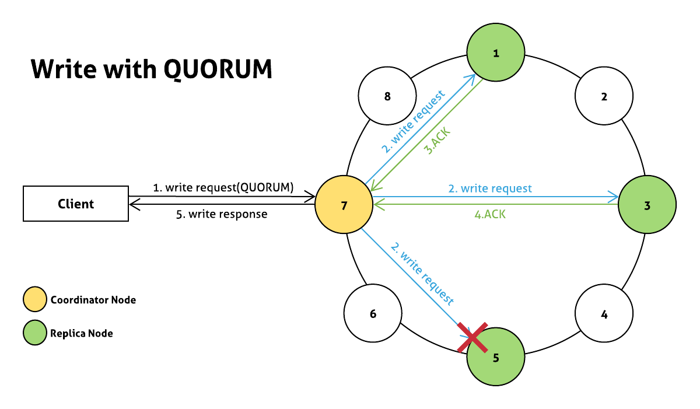
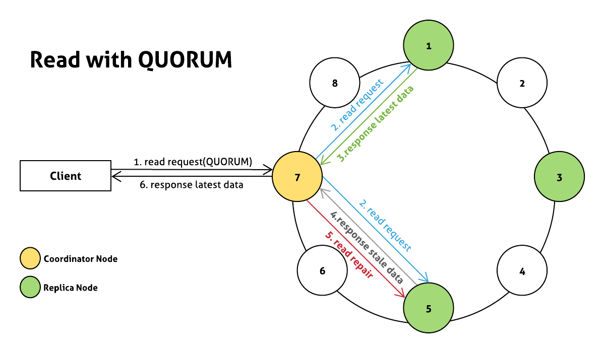

카산드라는 기본적으로 `Eventual consistency`를 보장하는 Storage system이지만 Consistency Level 설정에 따라 `Strong Consistency`를 보장받을 수 있다.

## Eventual Consistency vs Strong Consistency
### Eventual Consistency
- 최종적으로는 데이터의 Consistency를 보장하지만 현재 시점에는 데이터의 Consistency를 보장할 수 없다.
- 즉 `클라이언트에게 반환하는 데이터가 최신 상태의 데이터가 아닐 가능성이 존재하는 것이다.`
- 항상 최신 상태의 데이터 반환을 보장하지 않으므로 적은 수에 node에게 의존한다. 그러므로 Strong Consistency를 보장하는 시스템에 비해 `Availability은 높고 Latency는 낮다`

### Strong Consistency
- `클라이언트에게 반환하는 데이터가 항상 최신 상태의 데이터임을 보장한다.`
- 항상 최신 상태의 데이터를 반환해야 하므로 많은 수의 node에게 의존한다. 그러므로 Eventual Consistency를 보장하는 시스템에 비해 `Availability은 낮고 Latency는 높다`

### 요약
|  | Availability | Latency | return latest data
|---|:---:|---:|---:|
| Eventual Consistency | 높음 | 낮음 | 보장 X |
| Strong Consistency | 낮음 | 높음 | 보장 O |

## Strong Consistency를 보장할 수 있는 Consistency Level

> Consistency Level에 대해 궁금하시면 [카산드라 Consistency Level](https://pompitzz.github.io/blog/Cassandra/Cassandra_Consistency_Level.html#write-consistency-levels) 게시글을 참고하세요.

**카산드라 Ring Cluster 구성은 아래와 같다고 가정한다.**

- Single datacenter
- Replication factor: 3

### 1. Write: ALL, Read: ONE
- Write consistency level이 ALL이므로 `모든 replica node에 write request가 처리되어야 한다.`
- Write ALL로 인해 모든 replica node가 최신 데이터를 가지므로 특정 `하나의 node에게만 Read 요청을 보내도 최신 상태 데이터를 반환 받을 수 있다.`

**특징**
- 하나의 node만 다운되어도 Write가 실패하므로 `Availability가 낮다.`
- 하지만 Read를 ONE으로 할 수 있기 때문에 `Read Reuqest의 latency를 최대한 적게하면서 Strong Consistency를 보장할 수 있다.`
- Strong consistency가 필요하고 write에 비해 read request가 매우 많다면 고려해볼만 하다.

### 2. Write: QUORUM, Read: QUORUM
- replication factor가 3이므로 QUORUM=2이다.[(QUORUM 구하는 법)](/Cassandra/Cassandra_Consistency_Level.html#_2-each-quorum)
- 즉 2개의 replica node에 write request가 처리되면 Write 동작은 성공한다.
- 그리고 read request 또한 2개의 replica node에게 전달되므로 전달 받은 `두개의 node중 하나의 node는 반드시 최신 상태의 데이터를 가지고 있으므로 Strong Consistency가 보장된다.`  

**특징**
- Read와 Write가 두 개의 node에게 의존하므로 `하나의 node가 down되어도 정상 동작`
- Strong consistency가 필요한 경우 가장 무난하게 적용할 수 있는 Level

### 3. Write: ONE, Read: ALL
- Write consistency level이 ONE이므로 하나의 replica node에 write request가 처리되면 Write 동작은 성공한다.
- Read consistency level이 ALL이므로 `모든 replica node에게 read request가 전달되므로 Strong Consistency가 보장된다.`

**특징**
- 하나의 node만 다운되어도 Read가 실패하므로 `Availability가 낮다.`
- 하지만 Write를 ONE으로 할 수 있기 때문에 `Write Reuqest의 latency를 최대한 적게하면서 Strong Consistency를 보장할 수 있다.`
- Strong consistency가 필요하고 트래픽이 write request의 트래픽이 크다면 고려해볼만 하다.

> multiple datacenter로 카산드라 클러스터를 구성했을 경우 datacenter 사용 방식에 따라 LOCAL_QUORUM을 활용할 수도 있습니다.
---

### 어떻게 Strong Consistency가 보장 될까? 
`Write: QUORUM, Read: QUORUM` 케이스에 대한 예시

1. client가 QUORUM consistency level로 write request 전송
2. coordinator node는 `모든 replica node에게 write request를 전달`
3. 1번 노드에서 write가 완료되어 ACK 응답
4. 3번 노드에서 write가 완료되어 ACK 응답
5. QUORUM(2)수 만큼의 replica node에서 write request가 성공했으므로 client에게 응답

> **5번 노드는 이슈로 인해 write request 실패**

---

1. client가 QUORUM consistency level로 read request 전송
2. coordinator node는 `QUORUM 수 만큼의 replica node에게 read request를 전달`
3. 1번 노드는 latest data를 반환
4. `5번 노드는 이전의 write request가 실패했으므로 stale data를 반환`
5. coordinator node는 응답받은 두 개의 데이터의 timestamp를 비교하여 stale data를 가진 5번 node가 latest data를 가질 수 있도록 read repair 수행 ([Detail Docs](https://docs.datastax.com/en/cassandra-oss/3.0/cassandra/operations/opsRepairNodesReadRepair.html))
6. client에게 latest data를 반환

> 실제로는 하나의 node에게 direct read request를 보내고 나머지 node에겐 digest request를 보냅니다. 자세한 내용이 궁금하시면 공식 문서([How are read requests accomplished?
](https://docs.datastax.com/en/cassandra-oss/3.0/cassandra/dml/dmlClientRequestsRead.html))를 참고하세요.

## 참고 자료
- [How are consistent read and write operations handled?(Datastax)](https://docs.datastax.com/en/cassandra-oss/3.0/cassandra/dml/dmlAboutDataConsistency.html)
- [How are read requests accomplished?(Datastax)](https://docs.datastax.com/en/cassandra-oss/3.0/cassandra/dml/dmlClientRequestsRead.html)
- [How are write requests accomplished?(Datastax)](https://docs.datastax.com/en/cassandra-oss/3.0/cassandra/dml/dmlClientRequestsWrite.html)
