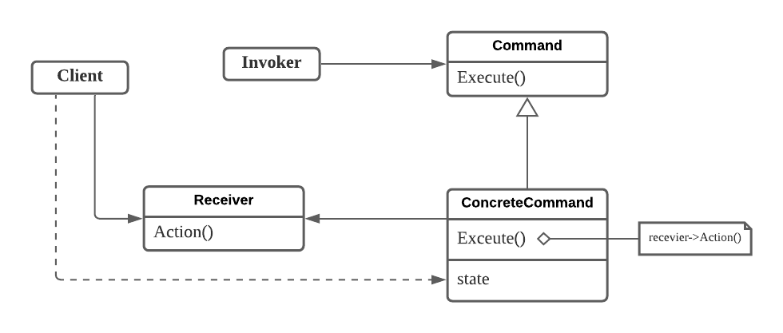

**행동 패턴은 객체나 클래스에 대한 패턴을 정의하는 것이 아닌, 그들 간의 교류 방법에 대해 정의하는 것이다.**

이 행동 패턴을 사용하면 우리는 객체 간에 제어 구조보다는 객체들을 어떻게 연결시킬 것인지에 좀더 집중할 수 있다.

## 책임 연쇄(Chain of Responsibility) 패턴
메시지를 보내는 객체와 이를 받아 처리하는 객체들 간의 결합도를 없애기 위한 패턴
- 하나의 요청에 대한 처리가 반드시 한 객체에서만 되지 않고, 여러 객체에게 그 처리 기회를 주려는 것

**이 패턴의 아이디어는 메시지 송신 측과 수신 측을 분리하는 것**
- 송신 측이 자신이 아는 주체에게 처리를 요청하면, 이를 수신한 객체가 자신과 연결된 고리를 따라서 계속 이 요청을 전달하고, 이 중에 한 객체가 적합하다고 판단되면 정의된 서비스를 제공한다.
- 객체의 연결 고리에 존재하는 객체는 누구든지 동일한 요청을 처리할 수 있어야 하므로 공통된 인터페이스를 가져야 한다.
- 인터페이스의 기본 구현은 단순히 자신에게 도달한 요청을 연결 고리에 정의된 다음 객체에게 전달하는 것이다. 즉, 내가 처리할 수 있으면 처리하고 아니면 다음 객체에게 넘긴다.

### 구조

- **Handler**: 요청을 처리하는 인터페이스를 정의하고, 후속 처리자(successor)와 연결을 구현
- **ConcreteHandler**: 책임져야 할 행동이 있다면 스스로 요청을 처리하고 그렇지 않으면 후속 처리자에게 요청을 위임

### 활용성
- 하나 이상의 객체가 요청을 처리해야 하고, 그 요청 처리자 중 어떤것이 선행자인지 모를 때
- 메시지를 받을 객체를 명시하지 않은 채 여러 객체 중 하나에게 처리를 요청하고 싶을 때
- 요청을 처리할 수 있는 객체 집합이 동적으로 정의되어야 할 때

### 결과
- 객체 간의 행동적 결합도가 적어진다.
  - 다른 객체가 어떻게 요청을 처리하는지 몰라도 되고 단순히 다음 처리자만 인터페이스로 알면되므로 객체 간의 상호작용을 단순화시킨다.
- 객체에게 책임을 할당하는 데 유연성을 높일 수 있다.
- **메시지 수신이 보장되지는 않는다.**
  - 메시지를 처리할 객체를 명시적으로 지정하지 않으므로 처리되지 않을 수 있다.

### 사용예
- 책임 연쇄 패턴은 사용자의 이벤트를 처리하기 위해서 주로 사용된다.
  - 사용자가 특정 위젯의 버튼을 클릭했을 때 버튼 -> 위젯 -> 애플리케이션 순의로 버튼 클릭 이벤트가 연쇄적으로 전달되면서 클릭 이벤트가 처리될 수 있다.

## 명령(Command) 패턴
요청 자체를 캡슐화하여 대기, 로깅, 롤백등의 다양한 연산을 지원할 수 있도록 하는 패턴

### 구조

- **Command**: 연산 수행에 필요한 인터페이스
- **ConcreteCommand**: 정해진 명령에 대한 연산을 구현하는 객체로 보통 `Receiver`를 통해 연산을 수행하지만 Command 자체에서 모든 것을 처리하기도 한다. 
  - Receiver 사용 예시로 문서를 붙이는 일을 담당하는 `PasteCommand`는 `Document.Paste()`를 호출하여 연산을 수행하도록 할 수 있다. 
- **Invoker**: Command에게 처리를 수행할 것을 요청하는 객체
- **Receiver**: 요청에 관련된 연산 수행 방법을 알고 있는 객체

### 활용성
- 수행할 동작을 객체로 매개변수화하고자 할 때(콜백 함수)
- 서로 다른 시간에 요청을 명시하고. 저장하며, 실행하고 싶을 때
- 실행 취소 기능을 지원하고 싶을 때

### 결과
- Command는 연산을 호출하는 개체와 연산 수행 방법을 구현하는 객체를 분리한다.
- 새로운 Command 객체를 추가하기 쉽다.
- Command 여러 개를 Composite Command로 만들 수 있다.
