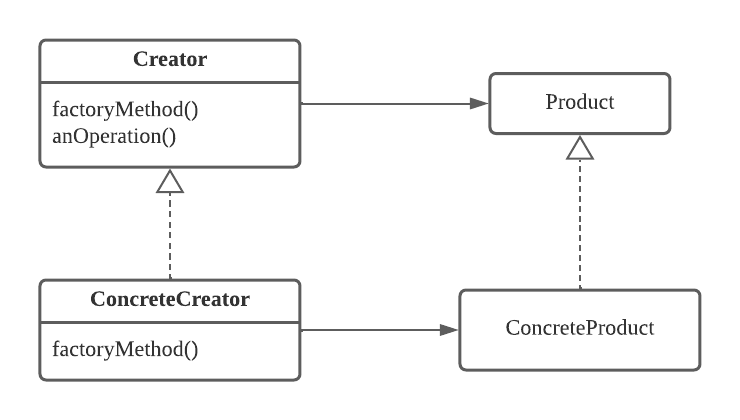

## 추상 팩토리(Abstract Factory) 패턴
서로 관련성 있거나 독립적인 여러 객체군을 생성하기 위한 인터페이스를 제공하는 패턴 

### 구조

- **AbstractFactory**: 개념적 제품들에 대한 생성 인터페이스를 정의
- **ConcreteFactory**: 구체적인 제품을 실제로 생성하는 구현 클래스
- **AbstractProduct**: 개념적인 제품 객체애 대한 인터페이스를 정의
- **ConcreteProduct**: 구체적인 제품들   

### 활용성
- 객체의 생성 및 표현되는 방식과 무관하게 시스템과 독립적으로 만들고 싶을 때
- 여러 제품군 중 하나를 선택해서 시스템을 설정해야 하고 한번 구성한 제품을 다른 것으로 대체할 수 있을 때
- 관련된 제품 객체들이 함께 사용되도록 설계되었고, 이 부분에 대한 제약을 외부에서도 지켜지도록 하고 싶을 때

### 결과
- 클라이언트에서는 추상화된 Factory와 Product만을 알게되고 구체적인 구현은 캡슐화 된다.
- 구체적인 구현이 캡슐화되어 제품군을 쉽게 대체할 수 있다.
    - 기존 시스템의 변경 없이 새로운 상황에 맞는 ConcreteFactory와 ConcreteProduct를 구현하기만 하면 된다.
- 제품 사이의 일관성을 증진시킨다.
    - 하나의 Factory에서 제품군을 생성하기 때문에 일관성을 가질 수 있다.
- **새로운 종류의 제품을 추가하기 어렵다.**
    - 새로운 제품 추가 시 모든 ConcreteFactory의 변경이 필요해진다.

> 추상 팩터리를 활용해 시스템에서 도메인 모델들에 대한 Repository 구현체들을 데이터베이스 별로 구분된 추상화된 Factory에서 제공하도록 하여 도메인의 변경없이 데이터베이스 시스템을 변경할 수 있을 것이다.

## 팩토리 메서드(Factory Method) 패턴
객체를 생성하기 위한 인터페이스를 정의하고, 서브클래스에서 해당 클래스의 인스턴스를 생성해주는 패턴

### 구조

- **Product**: 팩토리 메서드가 생성하는 객체의 인터페이스
- **ConcreteProduct**: 팩토리 메서드가 실제로 생성하는 인터페이스의 구현체
- **Creator**: 팩토리 메서드를 정의하는 인터페이스
- **ConcreteCreator**: 팩토리 메서드를 구현하여 `ConcreteProduct` 생성을 책임지는 구현체

### 활용성
- 어떤 클래스가 자신이 생성해야 할 객체의 클래스를 예측할 수 없을 때
- 생성할 객체를 기술하는 책임을 서브 클래스가 지정했으면 할 때

### 결과
- ConcreteProduct를 캡슐화하여 특정 구현에 대한 종속성을 제거해준다.

**병렬적인 클래스 계통**
- 팩토리 메서드는 병렬적인 클래스 계통이 만들어질 때 자주 사용된다.

> 팩토리 메서드 패턴은 생성 패턴 중 단순한 방법에 속하지만, 단점으로 제품 클래스가 바뀔 때 마다 새로운 서브클래스를 생성해야 한다.

## 단일체(Singleton) 패턴
오직 한 개의 클래스 인스턴스만을 갖도록 보장하고, 이에 대한 전역적인 접근정을 제공하는 패턴

### 싱글톤 레지스트리
싱글톤 레지스트리에 각 싱글톤별 이름을 갖도록 등록하고 이름을 통해 해당 싱글톤을 가져오도록 하면 싱글톤을 유연하게 사용할 수 있다.
- Spring에서 이 방식을 사용하여 빈의 싱글톤을 제공해준다.
