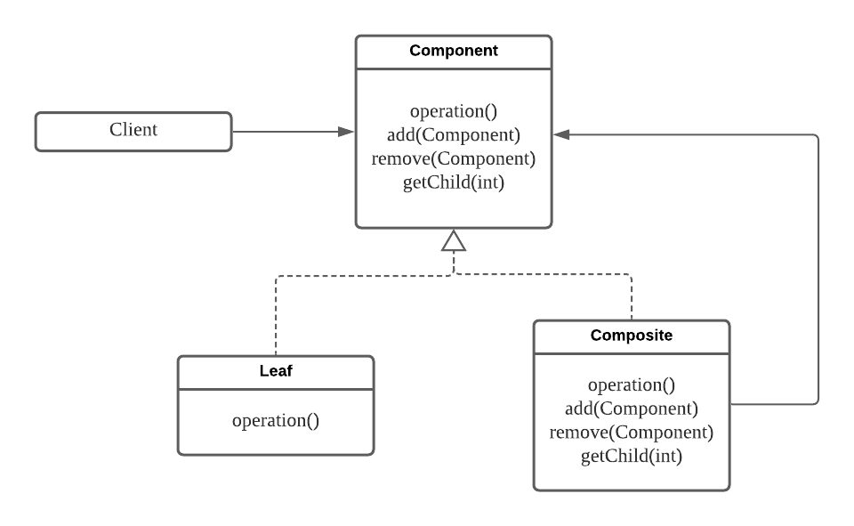
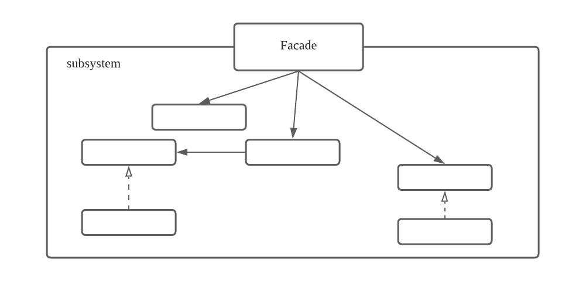
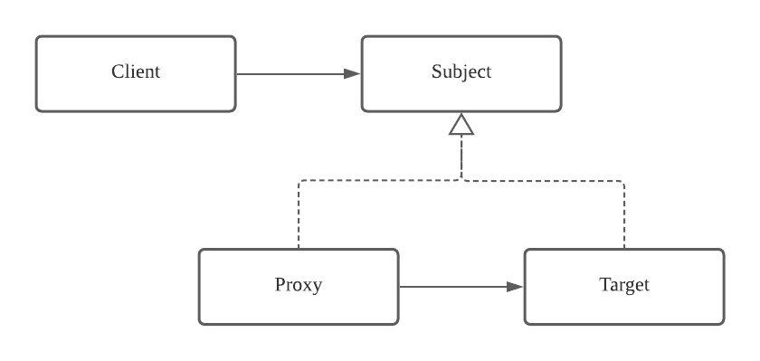

**구조 패턴은 더 큰 구조를 형성하기 위해 어떻게 클래스와 객체를 합성하는가와 관련된 패턴이다.**

## 적응자(Adapter) 패턴
특정 클래스의 인터페이스를 사용자가 기대하는 인터페이스 형태로 변환 시켜주는 패턴

### 구조

- **Target**: 클라이언트가 사용하는 인터페이스
- **Adapter**: Adaptee를 Target 인터페이스에 적응 시켜주는 Adapter
- **Adaptee**: Target 인터페이스로 변환이 필요한 Adaptee

### 활용성
- 기존 클래스를 사용하고 싶은데 인터페이스가 맞지 않을 때
- 이미 만든 것을 재사용하고자 하나 이 재사용 가능한 라이브러리를 수정할 수 없을 때

### 결과
- 기존 구현체들을 재사용하여 클라이언트가 원하는 인터페이스를 제공해줄 수 있다.
- Adapter를 적용하기 위한 작업량은 Target과 Adaptee간의 유사성에 달려 있다.
  - 단순한건 연산의 이름만 수정해도 되겠지만, 복잡한 경우엔 새로운 연산을 추가하여 새로운 기능을 정의해야 할 수도 있다.

### 관련 패턴
- Bridge, Decorator, Proxy패턴과 클래스 구조가 유사하나 사용 목적이 다르다.

## 복합체(Composite) 패턴
객체들을 트리 구조로 구성하여 개별 객체와 복합 객체를 동일하게 다룰 수 있도록 하는 패턴

### 구조

- **Component**: 개별, 복합 객체에 대한 인터페이스를 정의
- **Composite**: 자신이 복합하는 요소들을 이용하여 Component를 구현하는 구현체
- **Leaf**: 자식이 없고 operation만을 구현하는 기본 구현체

### 활용성
- 부분-전체의 객체 계통을 표현하고 싶을 때
- 클라이언트에서 개별, 복합 객체의 차이를 알지 못하고 동일한 인터페이스로 취급하도록 하고 싶을 때

### 결과
- Leaf, Composite 객체는 캡슐화되어 클라이언트는 일반화된 상위 개념인 Component에만 의존할 수 있어 코드가 단순해지고 확장이 가능해진다.
    - 클라이언트가 Component에만 의존할 수 있게 하기 위해선 Leaf는 실제 구현을 제공하지 않는 메서드도 구현이 필요하다. 이는 상속 규칙인 `리스코프 치환 원칙`을 위배한다.
    - 이를 해결하려면 클라이언트는 Leaf, Composite를 개별 대상으로 간주해야 하고 이는 Composite 패턴의 장점을 잃는다. 상황에 따른 트레이드오프가 필요하다. 
    
## 데코레이터(Decorator) 패턴
객체에 새로운 책임을 동적으로 추가할 수 있도록하는 패턴

### 구조

- **Component**: 동적으로 책임을 추가할 가능성이 있는 객체들의 인터페이스
- **ConcreteComponent**: 동적으로 책임이 추가되어야 할 객체
- **Decorator**: Component를 구현하면서 다른 Component를 참조하여 동적으로 책임을 추가할 수 있도록 하는 추상 클래스
- **ConcreteDecorator**: 동적으로 추가할 책임을 구현하는 구현체

> Decorator가 적거나 하나라면 추상 클래스를 정의하지 않는게 더 깔끔해보인다.

### 활용성
- 다른 객체에 영향을 주지 않고 개별 객체에 새로운 책임을 추가하기 위해 사용한다.

### 결과
- Decorator를 활용하면 런타임에 새로운 책임을 추가 및 제거가 가능해진다.
    - 상속을 통해 책임을 추가하기 위해선 클래스의 수가 매우 많아져 현실성이 없다.
- 동적으로 추가할 책임마다 Decorator를 정의해야 하므로 작은 규모의 객체들이 많아져 복잡성이 구조가 복잡해질 수 있다.

#### Decorator 패턴과 Strategy 패턴
- Decorator 패턴을 활용하기 위해선 Component를 가볍게 유지해야 한다. Component가 무거워지면 Decorator도 무거워져 새로운 Decorator를 추가하기 어려워진다.
- 만약 Component가 본질적으로 매우 복잡하고 무거운 특성을 갖는다면 Strategy 패턴이 더 좋은 해결 방안이다.
    - Strategy 패턴을 활용하면 Component 내부 구성요소의 기능을 동적으로 확장할 수 있다.
- Decorator 패턴은 객체의 외관을 변경하므로 Component는 Decorator에 대해 모른다.
- Strategy 패턴은 Component의 내부 구성요소에 대한 확장을 위한 것이므로 Component는 Strategy를 참조한다.

### 관련 패턴
- Decorator 패턴은 한 구소용소만을 갖는 Composite로 볼 수 있으므로 Composite와 관련된다. 하지만 Decorator의 목적은 객체의 합성이 아니라 새로운 책임을 추가하기 위함이다.
- Decorator 패턴은 객체의 외관을 변경하지만, Strategy 패턴은 객체의 내부를 변경한다. **이 둘은 객체를 변경하는 두 가지 다른 대안이다.**

## 퍼사드(FACADE) 패턴
- 서브시스템을 사용하기 쉽도록 상위 수준의 획일화된 하나의 인터페이스를 제공하는 패턴

### 구조

- **Facade**: 서브시스템을 어떻게 사용해야하는지 잘 알고 있어 단순하고 일관된 통합 인터페이스를 제공
  - 클라이언트는 서브시스템을 사용하기 위해 Facade만 참조하면 된다.

### 활용성
- 복잡한 서브시스템에 대한 단순한 인터페이스 제공이 필요할 때
- 클라이언트 혹은 다른 서브시스템 간의 결합도를 줄일 필요가 있을 때
    - 서브시스템에 정의된 모든 인터페이스를 공개하지 않고, 단순한 퍼사드만을 공개하여 결합도를 줄일 수 있다.
- 서브시스템을 계층화시킬 때
    - 퍼사드 패턴을 사용하여 각 서브 시스템의 계층에 대한 접근점을 제공한다.

### 결과
- 서브시스템의 구성요소를 보호할 수 있다.
- 서브시스템과 클라이언트간의 결합도를 약하게 만든다.
  - 구성요소를 보호하고, 클라이언트와의 결합도를 약하게 만들어 서브시스템 내부 설계 변경에 자유로울 수 있다.
  
### 관련 패턴
- 추상 팩터리 패턴은 서브시스템에 독립적인 방법으로, 서브시스템 객체를 생성하는 인터페이스를 제공하기 위해 퍼사드를 함께 사용할 수 있다.
- 중재자 패턴은 퍼사드 패턴과 비슷한 비슷하다.
  - 중재자 패턴은 여러 객체 사이의 협력관계를 추상화하여 중재자를 통해서만 상호작용할 수 있도록 한다.
  - 퍼사드 패턴은 서브시스템 인터페이스 자체를 추상화하여 사용을 용이하게 하려는 목적을 갖는다.

## 프록시(Proxy) 패턴
대상 객체에 대한 접근을 제어하기 위한 대리자 역할을 하는 객체를 두는 패턴

### 구조

- **Subject**: Target과 Proxy에 대한 공통 인터페이스를 정의하여 Target이 필요한 곳에 Proxy를 대체할 수 있도록 한다. 
- **Target**: 프록시가 대리자 역할을 하기 위한 대상 객체
- **Proxy**: Target을 참조하여 Proxy 특성에 따라 적절한 기능을 수행한다.

### 활용성
- remote proxy로 활용
  - 서로 다른 주소 공간에 존재하는 객체를 가리키는 로컬 환경에 존재하는 proxy
- virtual proxy로 활용
  - 요청이 있을 때 필요한 고비용 객체를 생성하는 proxy 
- protection proxy로 활용
  - 대상 객체의 접근을 제어하기 위한 proxy

### 결과
- 클라이언트는 Subject에만 의존하므로 클라이언트는 Proxy의 존재를 모른채 Proxy의 기능들을 제공할 수 있다.

### 관련 패턴
- Proxy 패턴은 Decorator 패턴과 구현 방법이 비슷하나 사용 목적이 다르다.
  - Proxy 패턴은 객체에 대한 접근을 제어하는 목적으로 사용된다.
  - Decorator 패턴은 동적으로 책임을 추가하기 위한 목적으로 사용된다.
  
### Composite vs Decorator vs Proxy
- **Composite 패턴과 Decorator 패턴은** 재귀적 합성 기법을 사용하기 때문에 **구조가 비슷하다. 하지만 목적은 다르다.**
  - `Decorator 패턴의 목적은` **상속 없이 객체에 새로운 기능을 추가하려는 것**이다.
  - `Composite 패턴의 목적은` 클래스 구조화에 초점을 맞춘것으로 **어떻게 관련 객체들을 하나의 인터페이스로 다룰 수 있도록 일관성을 부여하는 것**이다.
  - 이런 목적들을 상충되는 것이 아닌, 상호보완적이므로 두 패턴이 함께 사용할 때가 많이 있다.
- **Decorator 패턴과 Proxy 패턴은** 대상 객체에 대한 참조자를 관리하므로 **구조가 비슷하다. 하지만 목적은 다르다.**
  - Proxy는 Decorator와 달리 동적으로 어떤 기능을 추가 및 제거하지 않는다.
  - `Proxy 패턴의 목적은` **대상 객체에 대한 접근을 제어하는 것**이다. (캐시, 지연 로딩 또한 접근 제어 중 하나라고 볼 수 있다.)
  - Proxy 패턴은 참조하는 Target이 실제 기능을 제공하지만 Decorator 패턴은 Decorator 자체에서도 기능적인일을 담당한다. 
  - 그러므로 Decorator는 재귀적 합성이 중요하지만 Proxy에서는 단순이 메시지를 전달하므로 재귀적 합성은 전혀 의미가 없다.
- **각 패턴들은 구조가 비슷해보이지만, 서로 다른 객체지향 설계의 문제들을 해결하려는 목적이 있으므로 이러한 차이는 매우 중요하다.**
