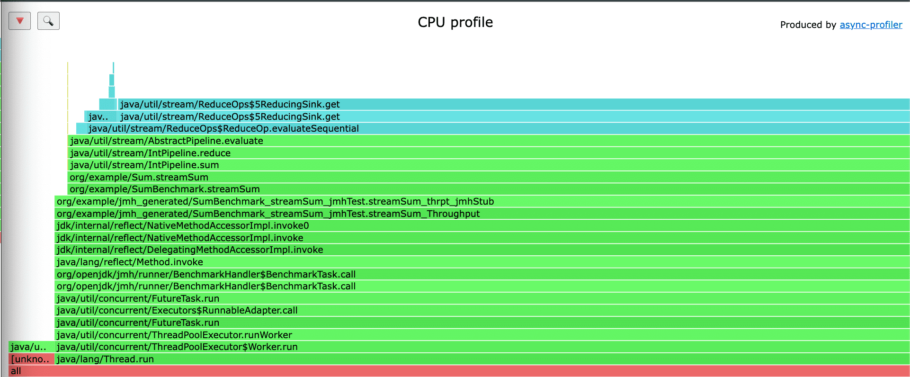

## JMH 사용
### gradle 플러그인 추가
```groovy
plugins {
  id "me.champeau.jmh" version "0.7.1"
}
```
- 별다른 의존성 추가없이 `build.gradle`에 JMH 플러그인([github](https://github.com/melix/jmh-gradle-plugin))만 추가하면 된다.

### 벤치마크 클래스 위치
```
src/jmh
     |- java       : java sources for benchmarks
     |- resources  : resources for benchmarks
```
- 벤치마크 클래스는 `src/main/java`가 아닌 `src/jmh/java`에 작성해야 한다.
- 플러그인이 `src/jmh/java` 내부의 클래스들이 `src/main/java`에 정의된 클래스를 의존할 수 있게 자동으로 구성해준다. 
- JMH 옵션에서 `includeTests=true`로 설정하면 테스트코드도 의존할 수 있게 설정가능하다.

### JMH 옵션 설정하기
```
jmh {
    iterations = 3
    warmupIterations = 3
    fork = 1
}
```
- `build.gradle`에서 jmh 블럭에서 설정할 수 있다.
- 모든 옵션은 [JMH 플러그인 github](https://github.com/melix/jmh-gradle-plugin)에 자세히 나와있다.

### 벤치마크할 함수 작성
```java
// src/main/java
import java.util.stream.IntStream;

public class Sum {
    public static int forSum(int maxNum) {
        int sum = 0;
        for (int i = 1; i <= maxNum; i++) {
            sum += i;
        }
        return sum;
    }

    public static int streamSum(int maxNum) {
        return IntStream.rangeClosed(0, maxNum).sum();
    }
}
```
- 1부터 `maxNum`까지의 숫자를 모두 더하는 함수를 for문과 stream을 이용해서 작성해보고 이 둘의 성능을 비교해보자.  

### 벤치마크 클래스 작성
```java
// src/jmh/java
import org.openjdk.jmh.annotations.Benchmark;
import org.openjdk.jmh.annotations.Scope;
import org.openjdk.jmh.annotations.State;
import org.openjdk.jmh.infra.Blackhole;

@State(Scope.Benchmark)
public class SumBenchmark {
    @Benchmark
    public void forSum(Blackhole bh) {
        bh.consume(Sum.forSum(1000));
    }

    @Benchmark
    public void streamSum(Blackhole bh) {
        bh.consume(Sum.streamSum(1000));
    }
}
```
- 기본적인 사용법은 클래스에 `@State`로 scope를 지정하고 벤치마크할 메서드에 `@Benchmark`를 붙이면 된다.
- [JMH Sample](https://github.com/openjdk/jmh/tree/master/jmh-samples/src/main/java/org/openjdk/jmh/samples) 에서 다양한 JMH Annotation들의 사용법을 살펴볼 수 있다.
- `bh.consume`에 함수의 결과를 넘기는 이유는 JVM이 의도치않게 최적화 하는것을 방지하기 위함이다.

### 실행
```
./gradlew jmh
```
- `jmh` gradle 태스크를 실행하면 `/src/jmh/java`내의 벤치마크 클래스들의 벤치마크가 수행된다.
- JMH Options에서 `includes`를 사용하면 원하는 벤치마크 클래스를 설정할 수 있다. 

### 결과
```
Benchmark                Mode  Cnt        Score        Error  Units
SumBenchmark.forSum     thrpt    3  4114130.377 ± 111486.127  ops/s
SumBenchmark.streamSum  thrpt    3  3348063.640 ± 236175.095  ops/s

Benchmark result is saved to /Users/dongmyeonglee/Projects/temp/jmh_blog/build/results/jmh/results.txt

BUILD SUCCESSFUL in 2m 2s
6 actionable tasks: 6 executed
```
- 결과를 보면 `forSum`함수의 스코어가 더 높은 것을 확인할 수 있다. 
- 단위가 `ops/s`이므로 초당 연산 수가 `forSum`이 더 높은 것이다. 즉 `forSum`의 성능이 더 뛰어나다.

## async profiler로 flame graph 출력하기
해당 벤치마크할 함수들을 flame graph로 출력하면 호출 스택과 각 호출에 소요된 시간을 한눈에 파악할 수 있다. 왜 `forStream`이 더 느린지 flame graph로 파악해보자.

### 라이브러리 다운
- [async-profiler git](https://github.com/async-profiler/async-profiler)에서 자신의 OS에 맞는 async-profiler를 다운로드하고 압축을 해제한다.

### JMH 옵션 설정하기
```groovy
jmh {
    iterations = 3
    warmupIterations = 3
    fork = 1
    profilers = ['async:libPath=/Users/Utils/async-profiler-2.9-macos/build/libasyncProfiler.so;output=flamegraph;dir=async-profiler-results']
}
```
- `profilers` 옵션에서 사용하고자 하는 프로파일러를 지정할 수 있다.
- async-profiler를 사용하므로 `async:`를 시작으로 필요한 async-profiler 옵션을 붙이면된다.
- `libPath`에 다운로드한 async-profiler의 파일 위치를 입력하면 된다. MacOS기준으로 `build/libasyncProfiler.so`를 사용하면된다. 
- `flamegraph`로 출력하기 위해 output 옵션을 붙이고 `async-profiler-results` 폴더에 결과를 저장하도록 설정했다.
- JMH에서 async-profiler에 설정할 수 있는 옵션목록을 보는게 까다로워서 따로 첨부한다.
  - 코드레벨에서 확인도 가능하다: [AsyncProfiler.java](https://github.com/openjdk/jmh/blob/master/jmh-core/src/main/java/org/openjdk/jmh/profile/AsyncProfiler.java)

::: details async-profiler options(클릭)
```
Usage: -prof <profiler-name>:opt1=value1,value2;opt2=value3

Options accepted by async:

output=<format+>                 Output format(s). Supported: [text, collapsed,
flamegraph, tree, jfr]. (default: [text])

direction=<direction>            Direction(s) of flame graph. Supported: [forward,
reverse, both]. (default: [both])

libPath=<path>                   Location of asyncProfiler library. If not specified,
System.loadLibrary will be used and the library
must be made available to the forked JVM in an entry
of -Djava.library.path, LD_LIBRARY_PATH (Linux),
or DYLD_LIBRARY_PATH (Mac OS).

event=<event>                    Event to sample: cpu, alloc, lock, wall, itimer;
com.foo.Bar.methodName; any event from `perf list`
e.g. cache-misses (default: [cpu])

alloc=[sample bytes]             Enable allocation profiling. Optional argument
(e.g. =512k) reduces sampling from the default of
one-sample-per-TLAB. May be captured as a secondary
event under output=jfr.

lock=[duration]                  Enable lock profiling. Optional argument (e.g.
=1ms) limits capture based on lock duration. May
be captured as a secondary event under output=jfr.

dir=<dir>                        Output directory.

interval=<ns>                    Profiling interval.

jstackdepth=<frames>             Maximum Java stack depth.

framebuf=<bytes>                 Size of profiler framebuffer.

filter=<boolean>                 Enable thread filtering during collection. Useful
for wall clock profiling, but only if the workload
registers the relevant threads programatically
via `AsyncProfiler.JavaApi.getInstance().filterThread(thread,
enabled)`. (default: [false])

threads=<bool>                   Profile threads separately.

simple=<bool>                    Simple class names instead of FQN.

sig=<bool>                       Print method signatures.

ann=<bool>                       Annotate Java method names.

include=<regexp+>                Output only stack traces containing the specified
pattern.

exclude=<regexp+>                Exclude stack traces with the specified pattern.

rawCommand=<command>             Command to pass directly to async-profiler. Use
to access new features of JMH profiler that are not
yet supported in this option parser.

title=<string>                   SVG title.

width=<pixels>                   SVG width.

minwidth=<pixels>                Skip frames smaller than px

allkernel=<bool>                 Only include kernel-mode events.

alluser=<bool>                   Only include user-mode events.

cstack=<mode>                    How to traverse C stack: Supported: [fp, lbr, no].

verbose=<bool>                   Output the sequence of commands. (default: [false])

traces=<int>                     Number of top traces to include in the default output.
(default: [200])

flat=<int>                       Number of top flat profiles to include in the default
output. (default: [200])

help                             Display help.
```
:::

### 실행
```
./gradlew jmh
```
- 실행 방법은 jmh 벤치마크를 돌리면 된다.

### 결과
```
Benchmark                       Mode  Cnt        Score        Error  Units
SumBenchmark.forSum            thrpt    3  4101825.711 ± 194568.428  ops/s
SumBenchmark.forSum:·async     thrpt               NaN                 ---
SumBenchmark.streamSum         thrpt    3  3326454.191 ± 271385.971  ops/s
SumBenchmark.streamSum:·async  thrpt               NaN                 ---

Benchmark result is saved to /Users/dongmyeonglee/Projects/temp/jmh_blog/build/results/jmh/results.txt

BUILD SUCCESSFUL in 2m 3s
7 actionable tasks: 7 executed
```
- 이전과 다르게 `SumBenchmark.forSum:·async`, `SumBenchmark.streamSum:·async`가 추가된 것을 확인할 수 있다.
- `async-profiler-results`폴더를 확인해보면 각 벤치마크별 flame graph html 파일이 존재하고 해당 html 파일을 열면 flame graph를 볼 수 있다. 

**forSum_flamegraph**:


**streamSum_flamegraph**:



- flame graph를 보면 `forSum`보다 `streamSum`에서 추가적인 함수 호출이 존재하는 것을 확인할 수 있다. 
- `streamSum`의 추가적인 함수 호출로 인해 스코어가 더 낮은 것이라고 예측이 가능하다.
- 조금 더 복잡한 로직을 벤치마크 돌릴 떄 flame graph를 활용하면 병목 지점을 찾는데 유용하게 사용할 수 있을 것이다.

## 참고자료
- [켠 김에 PR까지 18: JMH 와 async-profiler 로 병목 지점을 찾아 보자!](https://www.youtube.com/watch?v=5UltOhDOjr0&t=3662s)

