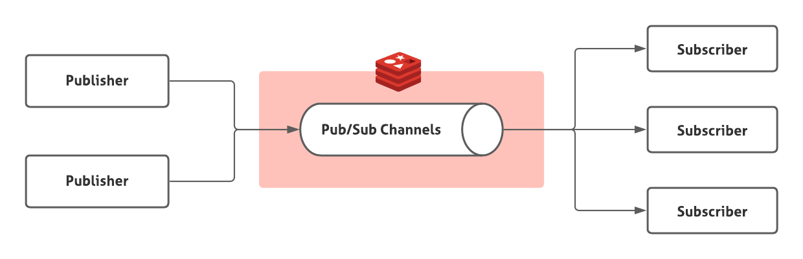
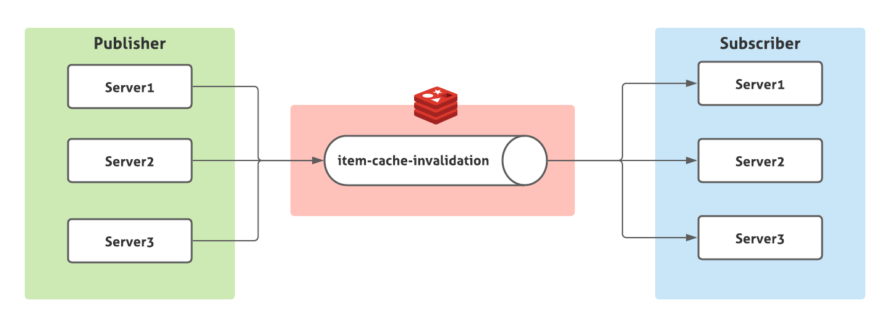

대규모 트래픽이 발생하는 Stateless 애플리케이션 웹 서버를 운영할 때 낮은 레이턴시와 데이터베이스 부하 감소를 위해 캐시는 필수적으로 사용된다.

웹 서버에 빠르고 손 쉽게 캐시를 추가하는 방법은 로컬 인메모리 캐시를 추가하는 것이다. 하지만 **대부분의 웹서버는 수많은 인스턴스로 운영되며 캐시되는 데이터가 수정될 때 모든 인스턴스의 로컬 캐시에 동기화하여야 한다.**

이런 문제를 해결하기 위해, 흔히 Redis와 같은 캐시 서버를 사용할 수 있다. Redis 서버에 데이터를 캐시한다면 데이터가 변경될 때 Redis 캐시만 업데이트하면 되기 때문에 캐시 동기화 문제가 해결된다.

**하지만 Redis에 캐시 데이터를 보관할 만큼의 여력이 없거나(대표적으로 비용), Redis도 결국 네트워크 지연을 피할 순 없으므로 매우 낮은 레이턴시가 요구된다면 로컬 캐시 사용이 필요할 수 있다.**

**로컬 캐시를 사용할 때 캐시 동기화를 위해 `Redis Pub/Sub`를 사용하면 모든 인스턴스에 캐시 동기화를 손쉽게 구현할 수 있다.**

먼저 `Redis Pub/Sub`에 대해서 알아보자.

## Redis Pub/Sub


Redis Pub/Sub는 `Publisher`가 지정된 `channel`에 메시지를 보내면 해당 채널을 구독하고 있는 `모든 Subscriber`에게 해당 메시지를 전달해준다.

클라이언트는 여러 `channel`을 동시에 구독하여 관심있는 채널의 메시지들을 전달받을 수 있고 `publisher` 또한 여러개 존재할 수 있다.

`Publisher`와 `Subscriber`는 서로를 모르고 중앙의 Redis Pub/Sub `channel`을 통해서만 메시지를 주고 받는다. 

Kafka와 구조는 동일하지만 메시지를 따로 저장하지 않고, 구독한 모든 `Subscriber`들에게 메시지가 전달되는(Kafka는 동일 컨슈머 그룹에 여러 컨슈머가 동일 토픽을 구독하면 한 컨슈머에게만 메시지가 전달된다.) 등의 차이점이 있다.

## 로컬 캐시 동기화

웹 애플리케이션 서버 3대를 운영중이라고 해보자. 각 서버는 아이템을 캐시하고 있다. 아이템의 가격이 수정될 때 모든 서버의 로컬 캐시를 무효화하여 다시 데이터베이스에서 가져와 동기화할 수 있도록 해보자.

자바 기반 프로젝트이고 실제로 웹 서버를 띄우진 않고 간단히 테스트 코드를 통해 확인을 진행한다.

### 프로젝트 세팅
```groovy
plugins {
    id 'java'
}

group 'org.example'
version '1.0-SNAPSHOT'

repositories {
    mavenCentral()
}

dependencies {
    implementation 'io.lettuce:lettuce-core:6.1.5.RELEASE'
    implementation 'com.google.guava:guava:31.0.1-jre'
    implementation'org.slf4j:slf4j-simple:1.7.32'

    compileOnly 'org.projectlombok:lombok:1.18.22'
    annotationProcessor 'org.projectlombok:lombok:1.18.22'

    testImplementation 'org.assertj:assertj-core:3.21.0'
    testImplementation 'org.junit.jupiter:junit-jupiter-api:5.8.2'
    testRuntimeOnly 'org.junit.jupiter:junit-jupiter-engine:5.8.2'
}

test {
    useJUnitPlatform()
}

```
- Redis 클라이언트 라이브러리로 `lettuce`를 사용하고 로컬 캐시 라이브러리는 `guava`를 사용한다. 편의를 위해 lombok, assertj도 추가하였다.

### 기반 클래스 정의
```java
@Getter
@AllArgsConstructor
public class Item {
    private Long id;
    private String name;
    private int price;

    public void updatePrice(int newPrice) {
        this.price = newPrice;
    }
}

public class ItemRepository {
    private final Map<Long, Item> store = new ConcurrentHashMap<>();

    public void saveItem(Item item) {
        store.put(item.getId(), new Item(item.getId(), item.getName(), item.getPrice()));
    }

    public Optional<Item> getItem(Long id) {
        return Optional.ofNullable(store.get(id))
                .map(item -> new Item(item.getId(), item.getName(), item.getPrice()));
    }
}
```
- 가격을 수정할 수 있는 `Item`, 데이터베이스 역할을 하는 `ItemRepository`를 정의한다.

### 캐시가 동기화가 되지 않을 때(without Redis Pub/Sub) 
```java
public class ItemService {
    private final Cache<Long, Item> cache;
    private final ItemRepository repository;

    public ItemService(ItemRepository repository) {
        this.cache = CacheBuilder.newBuilder()
                                 .expireAfterWrite(Duration.ofSeconds(1))
                                 .build();
        this.repository = repository;
    }

    public void addItem(Item item) {
        repository.saveItem(item);
        cache.put(item.getId(), item);
    }

    public void updateItemPrice(Long id, int price) {
        Item item = repository.getItem(id)
                                  .orElseThrow(() -> new IllegalArgumentException("cannot find item. id: " + id));
        item.updatePrice(price);
        addItem(item);
    }

    public Item getItem(Long id) {
        Item itemFromCache = cache.getIfPresent(id);
        if (itemFromCache == null) {
            Optional<Item> itemFromDB = repository.getItem(id);
            itemFromDB.ifPresent(item -> cache.put(item.getId(), item));
            return itemFromDB.orElseThrow(() -> new IllegalArgumentException("cannot find item. id: " + id));
        }
        return itemFromCache;
    }
}
```
- 로컬 캐시를 사용하는 `ItemService`를 정의한다. **로컬 캐시는 1초후에 만료되며** ItemService는 Item을 추가, Item 가격을 수정, Item을 조회하는 기능을 제공한다.
- Item을 추가하거나 Item 가격을 수정할 때 로컬 캐시에 아이템을 추가한다.
- **Item을 조회할 땐 먼저 로컬 캐시에 데이터가 존재하는지 확인하고, 캐시에 없는 경우 DB에서 아이템을 조회한다.**
- **ItemService 인스턴스 하나가 하나의 Server가 된다.**

#### 테스트
```java
class ItemServiceTest {
    @Test
    @DisplayName("Item 가격이 수정될 때 캐시 만료 시간 전 까진 Item을 수정한 서버에서만 수정된 가격이 제공된다.")
    void localCacheInvalidationTest() throws Exception {
        ItemRepository repository = new ItemRepository();
        ItemService serviceForServer1 = new ItemService(repository);
        ItemService serviceForServer2 = new ItemService(repository);
        ItemService serviceForServer3 = new ItemService(repository);

        Item item1 = new Item(1L, "item1", 5000);
        serviceForServer1.addItem(item1);
        serviceForServer1.updateItemPrice(1L, 3000); // update item price in server1

        assertThat(serviceForServer1.getItem(item1.getId()).getPrice()).isEqualTo(3000); // updated price
        assertThat(serviceForServer2.getItem(item1.getId()).getPrice()).isEqualTo(5000); // not updated price
        assertThat(serviceForServer3.getItem(item1.getId()).getPrice()).isEqualTo(5000); // not updated price

        Thread.sleep(2000); // wait for cache invalidation

        assertThat(serviceForServer1.getItem(item1.getId()).getPrice()).isEqualTo(3000); // updated price
        assertThat(serviceForServer2.getItem(item1.getId()).getPrice()).isEqualTo(3000); // updated price
        assertThat(serviceForServer3.getItem(item1.getId()).getPrice()).isEqualTo(3000); // updated price
    }
}
```
- server1에서 가격을 수정하고 모든 서버에서 가격을 확인하면 **server1에서만 수정된 가격이 제공된다.**
- 캐시가 만료된 후에는 server2, server3도 DB에서 다시 아이템을 가져오기 때문에 수정된 가격이 제공된다.

### 캐시가 동기화될 때(with Redis Pub/Sub)


**모든 서버는 `item-cache-invalidation` channel을 구독하는 `Subscriber`이면서 또한 아이템 가격이 수정될 때 해당 channel에 메시지를 보내는 `Publisher`가 된다.**

```java
public class ItemServiceWithPubSub {

    public static final String CHANNEL = "item-cache-invalidation";

    private final Cache<Long, Item> cache;
    private final ItemRepository repository;
    private final Consumer<Long> cacheInvalidationMessagePublisher;

    public ItemServiceWithPubSub(ItemRepository repository, RedisClient client) {
        this.cache = CacheBuilder.newBuilder().expireAfterWrite(Duration.ofSeconds(1)).build();
        this.repository = repository;
        RedisPubSubCommands<String, String> connectionForSub = client.connectPubSub().sync();
        connectionForSub.getStatefulConnection()
                        .addListener(new RedisPubSubAdapter<>() { // 캐시를 만료시키는 리스너 추가
                            @Override
                            public void message(String channel, String message) {
                                cache.invalidate(Long.parseLong(message));
                            }
                        });
        connectionForSub.subscribe(CHANNEL); // 해당 채널을 구독
        
        RedisPubSubCommands<String, String> connectionForPub = client.connectPubSub().sync();
        // 캐시 무효화 메시지를 전송하는 Publsuher 추가
        this.cacheInvalidationMessagePublisher = id -> connectionForPub.publish(CHANNEL, id.toString());
    }

    public void addItem(Item item) {
        repository.saveItem(item);
        cache.put(item.getId(), item);
    }

    public void updateItemPrice(Long id, int price) {
        Item item = repository.getItem(id).orElseThrow(() -> new IllegalArgumentException("cannot find item. id: " + id));
        item.updatePrice(price);
        addItem(item);
        cacheInvalidationMessagePublisher.accept(id); // cache invalidation message 전송
    }

    public Item getItem(Long id) {
        Item itemFromCache = cache.getIfPresent(id);
        if (itemFromCache == null) {
            Optional<Item> itemFromDB = repository.getItem(id);
            itemFromDB.ifPresent(item -> cache.put(item.getId(), item));
            return itemFromDB.orElseThrow(() -> new IllegalArgumentException("cannot find item. id: " + id));
        }
        return itemFromCache;
    }
}
```
- 생성자에서 리스너를 추가하고 해당 channel을 구독하고 아이템 가격 수정 시 해당 channel에 메시지를 전송할 수 있는 publisher를 추가하였다.
- **아이템 가격이 수정될 때 publusher를 통해 itemId를 발행한다. 그러면 생성자에서 등록한 리스너에서 해당 메시지를 전달받아 로컬 캐시를 무효화 한다.**

#### 레디스 실행
```shell
# with brew
## redis 설치
brew install redis 
## start redis
brew services start redis

------------------------------------

# with docker
docker run --rm -p 6379:6379 redis
```

#### 테스트
```java
class ItemServiceWithPubSubTest {
    @Test
    @DisplayName("Item 가격이 수정되면 모든 서버에서 수정된 가격이 제공된다.")
    void localCacheInvalidationTest() throws Exception {
        ItemRepository repository = new ItemRepository();
        RedisClient client = RedisClient.create("redis://localhost");
        ItemServiceWithPubSub serviceForServer1 = new ItemServiceWithPubSub(repository, client);
        ItemServiceWithPubSub serviceForServer2 = new ItemServiceWithPubSub(repository, client);
        ItemServiceWithPubSub serviceForServer3 = new ItemServiceWithPubSub(repository, client);

        Item item1 = new Item(1L, "item1", 5000);

        serviceForServer1.addItem(item1);
        serviceForServer1.updateItemPrice(1L, 3000);
        Thread.sleep(10); // wait for redis

        assertThat(serviceForServer1.getItem(item1.getId()).getPrice()).isEqualTo(3000); // updated price
        assertThat(serviceForServer2.getItem(item1.getId()).getPrice()).isEqualTo(3000); // updated price
        assertThat(serviceForServer3.getItem(item1.getId()).getPrice()).isEqualTo(3000); // updated price

        Thread.sleep(2000); // wait for cache invalidation
        assertThat(serviceForServer1.getItem(item1.getId()).getPrice()).isEqualTo(3000); // updated price
        assertThat(serviceForServer2.getItem(item1.getId()).getPrice()).isEqualTo(3000); // updated price
        assertThat(serviceForServer3.getItem(item1.getId()).getPrice()).isEqualTo(3000); // updated price
    }
}
```
- 아이템 가격을 수정하고 모든 서버에서 아이템을 조회하면 즉시 수정된 가격이 제공되는 것을 확인 할 수 있다.   

### Publihser, Subscriber 커넥션 분리?
```java
public ItemServiceWithPubSub(ItemRepository repository, RedisClient client) {
    this.cache = CacheBuilder.newBuilder().expireAfterWrite(Duration.ofSeconds(1)).build();
    this.repository = repository;
    RedisPubSubCommands<String, String> connectionForSub = client.connectPubSub().sync();
    connectionForSub.getStatefulConnection()
                    .addListener(new RedisPubSubAdapter<>() { // 캐시를 만료시키는 리스너 추가
                        @Override
                        public void message(String channel, String message) {
                            cache.invalidate(Long.parseLong(message));
                        }
                    });
    connectionForSub.subscribe(CHANNEL); // 해당 채널을 구독

    RedisPubSubCommands<String, String> connectionForPub = client.connectPubSub().sync();
    // 캐시 무효화 메시지를 전송하는 Publsuher 추가
    this.cacheInvalidationMessagePublisher = id -> connectionForPub.publish(CHANNEL, id.toString()); 
}
```
- `ItemServiceWithPubSub` 생성자 코드를 보면 Publisher와 Subscriber를 각각 새로운 레디스 커넥션으로 사용하는 것을 알 수 있다.
- 그 이유는 **Subscriber 커넥션은 Subscriber와 관련된 명령어 이외에 다른 Redis 명령어를 사용할 수 없도록 되어있기 때문이다.**
  - lettuce의 경우 Subscriber 커넥션에서 다른 Redis 명령어를 실행하면 예외가 발생한다.(`io.lettuce.core.RedisException: Command GET not allowed while subscribed. Allowed commands are: [PSUBSCRIBE, QUIT, PUNSUBSCRIBE, SUBSCRIBE, UNSUBSCRIBE, PING]`) 
  - **Subscriber 커넥션에서 다른 명령어를 사용할 수 없는 이유는 구독된 channel에서 들어오는 메시지를 기다리는 동안 해당 커넥션은 블럭되기 때문으로 보여진다.**([참고](https://stackoverflow.com/questions/33982698/why-pub-sub-in-redis-cannot-be-used-together-with-other-commands?rq=1))
- Publihser의 경우 이러한 제약이 없기 때문에 커넥션 풀을 사용하도록 개선할 수 있다.

### 레디스 클러스터에서 Pub/Sub는 어떻게 동작할까?
- 각 레디스 서버들은 channel별 subscriber들의 정보를 가지고 있고 특정 channel에 메시지가 publish되면 요청을 받은 레디스 서버는 모든 노드에게 동일한 메시지를 publish하기 때문에 **레디스 클러스터에서 Pub/Sub는 아무 노드에서나 subsribe, publish를 해도 동일하게 동작한다.**
- 자세한 내용은 [Redis Cluster 에서의 Pub/Sub은 어떻게 동작할까?](https://charsyam.wordpress.com/2016/03/21/%EC%9E%85-%EA%B0%9C%EB%B0%9C-redis-cluster-%EC%97%90%EC%84%9C%EC%9D%98-pubsub%EC%9D%80-%EC%96%B4%EB%96%BB%EA%B2%8C-%EB%8F%99%EC%9E%91%ED%95%A0%EA%B9%8C/)를 참고하자.

### 패턴 매칭
- `Redis Pub/Sub`는 패턴 매칭 기반으로 subscribe, publish 하는 기능도 제공한다. 자세한 내용은 [공식 문서](https://redis.io/topics/pubsub)를 참고하자.
