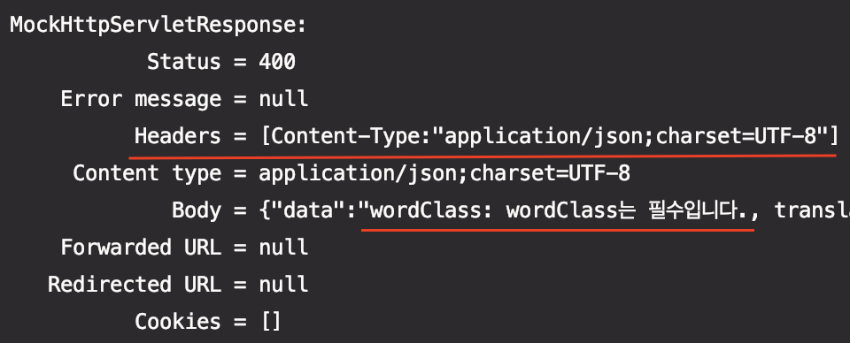

## 원인
- MediaType.APPLICATION_JSON_UTF8가 depreated되어 MediaType.APPLICATION_JSON를 사용하도록 변경되어 response header의 content-type에 `charset=UTF-8`가 제거되어 한글이 깨지는 것으로 파악된다.
- [참고 자료](https://github.com/spring-projects/spring-framework/issues/22788)

### 예시
```java
@AutoConfigureMockMvc
@SpringBootTest
class UserWordControllerTest {

    @Autowired
    MockMvc mockMvc;

    @Test
    void create_fail_when_request_body_is_invalid() throws Exception {
        // when && then
        mockMvc.perform(
                post("/language/userWord/1")
                        .contentType(MediaType.APPLICATION_JSON)
                        .content(OBJECT_MAPPER.writeValueAsString(CreateWordRequest.builder().build())))
                .andDo(print())
                .andExpect(status().isBadRequest());
    }

}
```


- content-type에 `charset=UTF-8`가 없고 한글이 깨진다.

## 해결법
- 문제를 해결하기 위해 MockMvc buid 시 `CharacterEncodingFilter`를 추가해주면 된다.
- MockMvc 설정을 위해 붙이는 `@AutoConfigureMockMvc`를 훑어보면 MockMvc build 시 `SpringBootMockMvcBuilderCustomizer`를 사용하는 것을 확인할 수 있다.
- SpringBootMockMvcBuilderCustomizer.addFilters에서는 bean으로 등록된 filter들을 가져와 mockMvc filter에 설정해준다.
- **그러므로 테스트 구동 시 CharacterEncodingFilter를 빈으로 등록해주면 문제를 해결할 수 있다.**

SpringBootMockMvcBuilderCustomizer.addFilters 로직
- 


### CharacterEncodingFilter를 빈으로 등록하는 Custom Annotation 생성
```java
@Target(ElementType.TYPE)
@Retention(RetentionPolicy.RUNTIME)
@Documented
@AutoConfigureMockMvc
@Import(EnableMockMvc.Config.class)
public @interface EnableMockMvc {
    class Config {
        @Bean
        public CharacterEncodingFilter characterEncodingFilter() {
            return new CharacterEncodingFilter("UTF-8", true);
        }
    }
}
```
- 해당 annotation에 `@AutoConfigureMockMvc`를 선언하였고 CharacterEncodingFilter를 빈으로 등록하였으니 해당 annotation을 테스트코드에 `@AutoConfigureMockMvc` 대신 선언하기만 하면 된다.

### 결과
```java
@EnableMockMvc
@SpringBootTest
class UserWordControllerTest {

    @Autowired
    MockMvc mockMvc;

    @Test
    void create_fail_when_request_body_is_invalid() throws Exception {
        // when && then
        mockMvc.perform(
                post("/language/userWord/1")
                        .contentType(MediaType.APPLICATION_JSON)
                        .content(OBJECT_MAPPER.writeValueAsString(CreateWordRequest.builder().build())))
               .andDo(print())
               .andExpect(status().isBadRequest());
    }

}
```



- 추가한 CharacterEncodingFilter에 의해 content-type에 `charset=UTF-8`가 추가되었고 한글이 정상적으로 출력된다.
