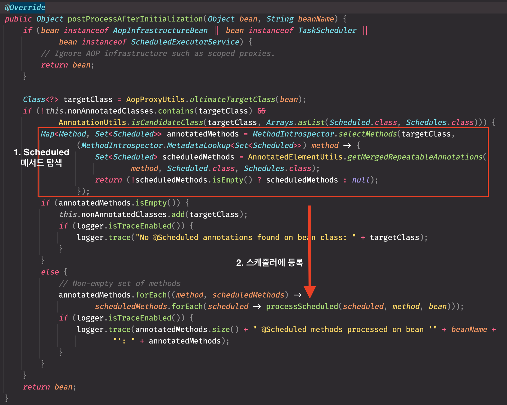
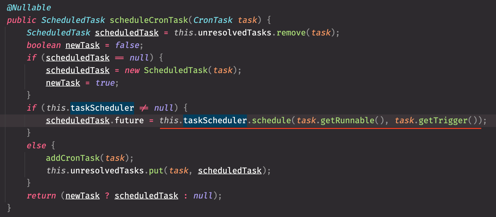
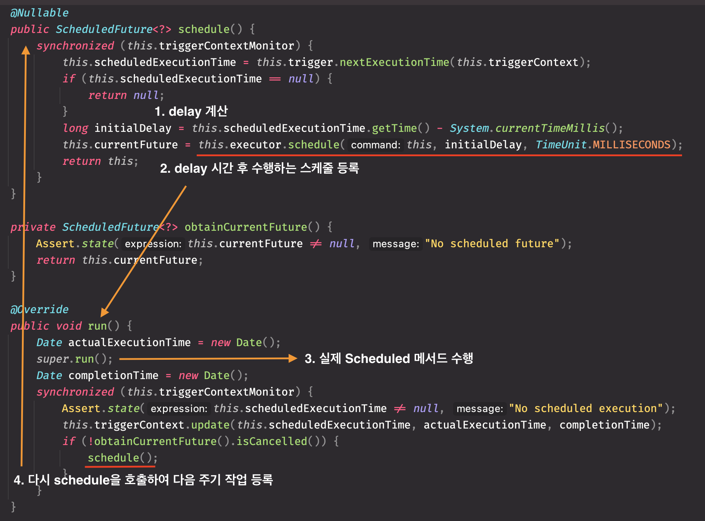

- 스프링 3.0부터 @EnableScheduling를 선언하여 스케줄링을 활성화 시키고 @Scheduled로 스케줄링할 작업을 간단히 추가할 수 있습니다.
- 스프링이 어떻게 스케줄링을 활성화 시키고 @Scheduled 메서드 작업을 주기적으로 수행시키는지 알아보겠습니다.

## 1. 스케줄링 활성화 및 실행

```java

@Slf4j
@Configuration
@EnableScheduling // 스케줄링을 위해 추가
public class SchedulerConfig {
    @Scheduled(cron = "0/1 * * * * *")
    public void test() {
        log.info("Hello World");
    }

    public static void main(String[] args) {
        new AnnotationConfigApplicationContext(SchedulerConfig.class);
    }
}
```
- @EnableScheduling을 선언하고 빈 내부 메서드에 @Scheduled를 추가하면 간단히 스케줄링 작업을 추가할 수 있습니다.
    - 해당 예시에선 cron표기법을 사용하여 1초마다 test()메서드가 수행되게 됩니다.

> 따로 ScheduledExecutorService나 SchedulerThreadPool 빈을 등록하지 않으면 디폴트로 단일 스레드풀을 사용합니다. 

## 2. TaskScheduler와 Trigger
```java
// 실제 작업을 스케줄링
public interface TaskScheduler {
	@Nullable
	ScheduledFuture<?> schedule(Runnable task, Trigger trigger);
}

// 작업이 수행되어야 할 시간 계산을 담당
public interface Trigger {
	@Nullable
	Date nextExecutionTime(TriggerContext triggerContext);
}
```
- 스프링은 추상화로 TaskScheduler와 Trigger 인터페이스를 제공합니다.
- TaskScheduler는 실제 작업을 스케줄링하고, Trigger에서 해당 스케줄링 작업을 트리거 될 시간을 계산해주는 역할을 담당하고 있습니다.
 
<br>


- 스프링이 기본으로 제공하는 구현체는 위와 같습니다.
- TaskScheduler의 경우 따로 스케줄러를 등록하지 않으면 ConcurrentTaskScheduler를 사용하게 됩니다.
    - 커스텀하게 ThreadPoolTaskScheduler를 빈으로 등록하면 해당 빈을 사용하게 됩니다.
- Trigger의 경우 위의 예시에서 cron 표기법을 사용하였기 때문에 CronTrigger가 사용됩니다.

## 3. 스케줄이 등록되고 실행되는 원리

### 1) ScheduledAnnotationBeanPostProcessor 등록
```java
@Target(ElementType.TYPE)
@Retention(RetentionPolicy.RUNTIME)
@Import(SchedulingConfiguration.class)
@Documented
public @interface EnableScheduling {
}


@Configuration
@Role(BeanDefinition.ROLE_INFRASTRUCTURE)
public class SchedulingConfiguration {
	@Bean(name = TaskManagementConfigUtils.SCHEDULED_ANNOTATION_PROCESSOR_BEAN_NAME)
	@Role(BeanDefinition.ROLE_INFRASTRUCTURE)
	public ScheduledAnnotationBeanPostProcessor scheduledAnnotationProcessor() {
		return new ScheduledAnnotationBeanPostProcessor();
	}

}
```
- 첫 번째 예시 코드에서 선언한 @EnableScheduling에 Import된 SchedulingConfiguration가 ScheduledAnnotationBeanPostProcessor를 빈으로 등록해줍니다.
    - 실제 ScheduledAnnotationBeanPostProcessor에서 스케줄링에 필요한 작업을 수행합니다. 

### 2) PostProcessor에서 @Scheduled 메서드 작업을 스케줄러에 등록

- PostProcessor.postProcessAfterInitialization에서 bean에 @Scheduled가 선언된 메서드들을 찾아 postScheduled를 호출합니다.

<br>


- PostProcessor.postScheduled에서 @Scheduled에 설정된 fixedDelay, fixedRate, cron등에 맞는 Task를 생성하여 ScheduledTaskRegistrar에 등록합니다.
    - cron 표기법을 사용하였으니 CronTask와 위에서 보았던 CronTrigger가 사용됩니다.    

> task에 사용되는 Runnable은 bean과 method(@Scheduled가 선언된 메서드)를 활용하여 method를 invoke하는 실제 작업입니다.
>
<br>


- ScheduledTaskRegistrar에서 taskScheduler에 작업을 스케줄링하게 됩니다.
- taskScheduler.schedule 메서드를 Runnable(@Scheduled 메서드 작업), Trigger(CronTrigger)와 함께 호출합니다.  


### 3) TaskScheduler에서 작업을 스케줄링

- TaskScheduler.schedule에서는 task, trigger, executor, errorhandler로 ReschedulingRunnable를 생성하고 schedule을 호출합니다.
- **실제로 수행할 작업은 Trigger를 통해 특정한 주기에 맞게 반복적으로 수행되어야 하는데 이러한 처리를 담당하는 곳이 ReschedulingRunnable입니다.** 

<br>


- RechedulingRuunable에서 Trigger를 통해 nextExecutionTime을 계산하여 schedule -> run -> schedule가 재귀적으로 호출되면서 스케줄링된 작업이 실제로 수행됩니다.   
