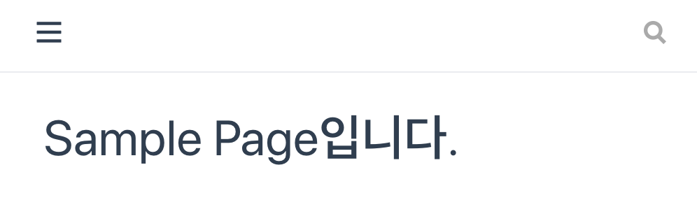

- VuePress를 이용하면 마크다운 파일들을 정적 html로 만들어 깃헙에 배포할 수 있습니다.
- VuePress는 일반적인 Vue와 다르게 **build 시 작성된 마크다운 파일들을 html로 변환하여 빌드하기 때문에 검색엔진에 최적화되어 있습니다.**
- VuePress에서 기본으로 제공해주는 테마와 필요한 부분들을 커스텀하여 나만의 블로그를 빠르고 쉽게 만들 수 있습니다.

## VuePress 설치 후 실행하기
### vuepress 추가
```shell script
# 폴더 생성 후 이동
mkdir vuepress
cd vuepress

# vuepress 추가
yarn init
yarn add -D vuepress
```

### md 파일 생성  
```shell script
# 마크다운 파일들을 위한 폴더 생성
mkdir blog
cd blog
echo "# Vuepress로 블로그 만들기" >> README.md # README.md 생성
echo "# Sample Page입니다." >> sample.md # sample.md 생성
```
- blog 폴더에서 README.md를 만든 후 텍스트를 넣어줍니다.

### package.json script 추가
```js
// package.json
{
  "name": "vuepress",
  "version": "1.0.0",
  "main": "index.js",
  "license": "MIT",
  // scripts 추가
  "scripts": {
    "dev": "vuepress dev blog",
    "build": "vuepress build blog"
  },
  "devDependencies": {
    "vuepress": "^1.5.0"
  }
}
```
- package.json에 scripts를 추가해줍니다.

### 빌드
```shell script
yarn build

# 빌드 후 빌드된 파일을 확인해보면 아래와 같이 구성
# .vuepress/dist/
-rw-r--r--  1 XXX  staff   1.2K  5 28 01:22 404.html
drwxr-xr-x  5 XXX  staff   160B  5 28 01:22 assets
-rw-r--r--  1 XXX  staff   2.3K  5 28 01:22 index.html
-rw-r--r--  1 XXX  staff   2.2K  5 28 01:22 sample.html
```
- 빌드후 dist 폴더에서 빌드된 파일을 확인해보면 모두 html로 변경된 것을 알 수 있습니다.
- index.html에는 README.md가, smaple.md는 sample.html로 변환됩니다.
    - **README.md의 경우 index.html이 되며 나머지는 해당 파일명과 동일한 html로 변환됩니다.**


### smple.html 접속


- yarn dev로 테스트 서버를 띄운 후 localhost:8080/sample.html로 접속하면 위와 같이 sample 페이지가 나타나는 것을 알 수 있습니다.


## VuePress 기본 테마 꾸미기
```js
// .vuepress/config.js 에서 설정
module.exports = {
    base: '/vuepress/', // base url을 설정합니다.
    title: 'VuePress 블로그',
    head: [['link', {rel: 'icon', href: 'img.png'}]], // html head에 넣을 값들을 설정
    themeConfig: {        // VuePress 기본 테마에 필요한 설정
        logo: '/vue.png', // title옆에 나타날 로고 이미지
        nav: [            // 페이지 우측 상단에 보여질 nav들
            {text: 'Home', link: '/'},
            {text: 'Sample', link: '/sample.html'},
        ]
    },
};
```
- 빌드를 하게되면 기본적으로 .vuepress/dist에 빌드파일이 저장됩니다.
- .vuepress폴더의 config.js를 생성하여 컴포넌트, 스타일 등을 정의할 수 있습니다.
- title, head뿐만아니라 logo, nav설정들을 간단하게 추가할 수 있습니다.
- logo의 사진같은경우 .vuepress/public 폴더의 파일을 불러올 수 있습니다.

> [VuePress Docs](https://vuepress.vuejs.org/theme/default-theme-config.html)를 참고하시면 더 많은 설정들을 확인할 수 있습니다.

### 변경된 테마 확인


- 수정 후 다시 테스트 서버를 띄우고 적용된 base url(localhost:8080/vuepress/)로 접속해보면 테마가 변경된 것을 확인할 수 있습니다.

<br>

> 다음 게시글에서는 해당 VuePress 프로젝트를 깃헙으로 푸시하면 자동으로 깃헙 페이지로 배포하는 작업을 진행해보겠습니다. 감사합니다. 

### 참고자료
- [VuePress Docs](https://vuepress.vuejs.org/)
